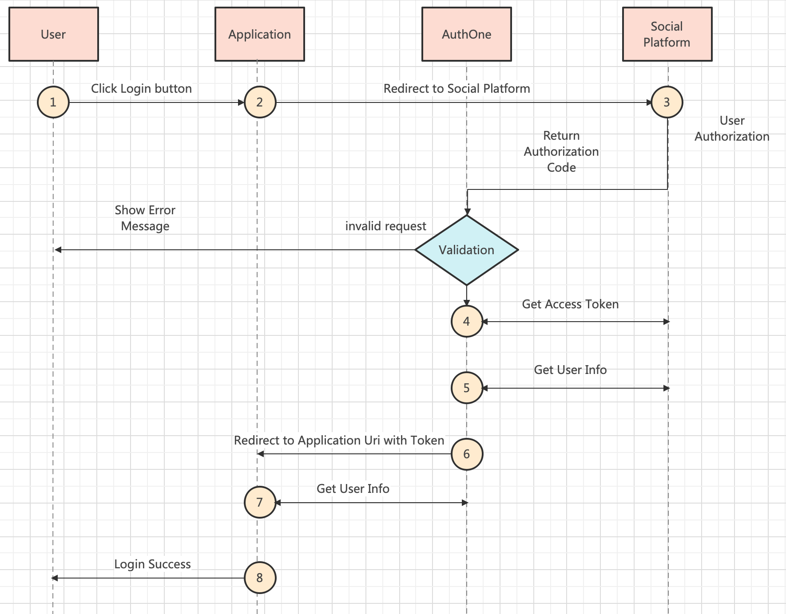
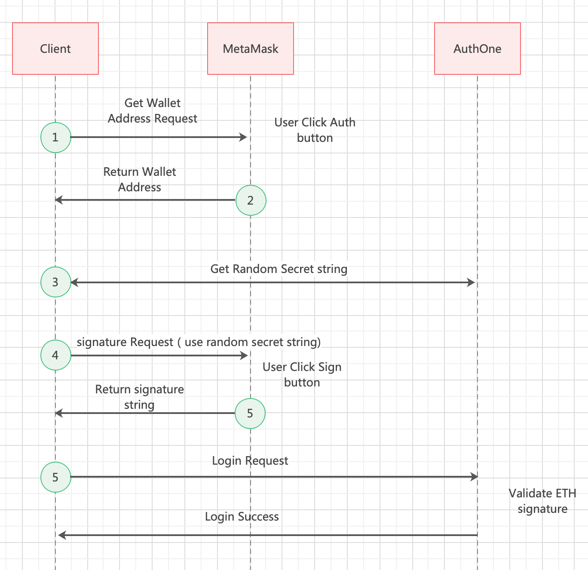

# AuthOne


## Auth Flow

### Social Platform auth flow



### MetaMask auth flow



## Web SDK

### Install

```bash
npm install authone

# or
yarn install authone
```


```javascript
import { AuthOne } from "authone"

const client = new AuthOne(app_id);

await client.loginWithRedirect("facebook");

const token = await client.getRedirectResult();
// request your backend api with token
```


## Python SDK

```python
from authone import AuthOneClient


client = AuthOneClient(app_id, app_secret=your_app_secret)

# this token get from web client request
resp = client.SocialUser.get_userinfo_by_token(token)

respdata = resp.data

print(respdata["user_id"])
print(respdata["user_name"])
print(respdata["email"])
```