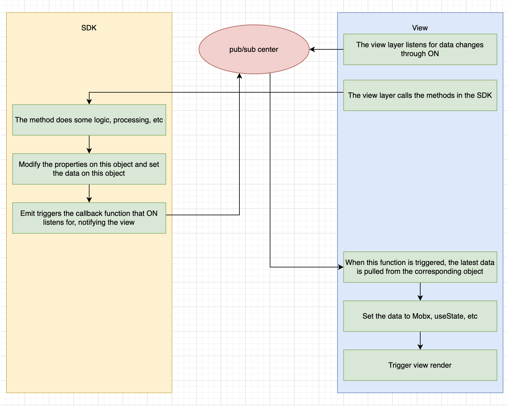
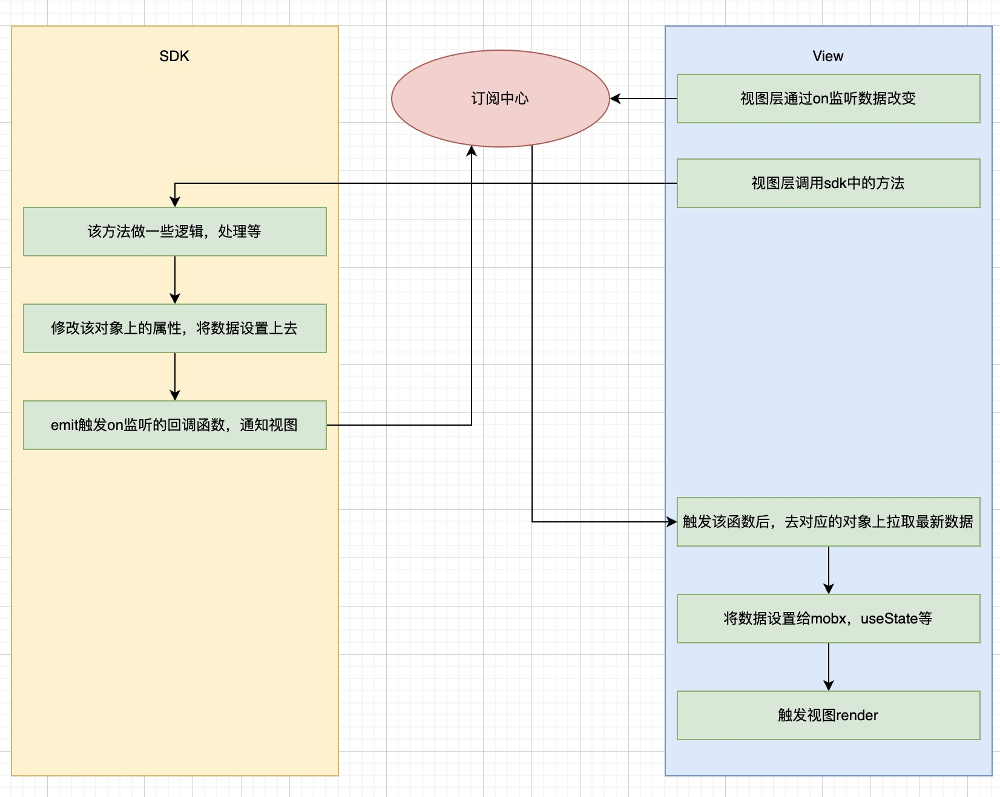

# Intro

web3-mq-js is the official JavaScript client for Web3MQ, a service for building chat applications.

# Design

#### The client class is the main entry point and contains and mounts the basic properties and other classes such as Channel, Message, etc.

#### SDK There are two kinds of core ideas (can't understand? No problem! Look down the chart)

> 1. Pub Sub Mode：Manage data via publish-subscribe design pattern and notify view updates, The advantage of this is that the data can be maintained inside the sdk for unified management, and the view layer only needs to get the latest data on the sdk object in the callback function after each data update, and then trigger the view update to see the latest data display.
> 2. Normal api mode：Call the method, return the corresponding data to the view layer, and let the user maintain the relationship between the data and the view（Under development...）

#### The sdk follows the following rules to form a closed loop, (don't understand? No problem! Scroll down to see the code




#### Use the channelList in the channle class to demonstrate how to use it in react

```ts
import React, { useState } from "react";
import { Web2MQ } from "web3-mq";

const App = () => {
  const [channels, setChannels] = useState<ChannelResponse[]>([]);

  // 1. First initialize the client instance
  const client = Web2MQ.Client.getInstance("YOUR_ACCESS_TOKEN");

  // 2. Add a listener method to the channelList using the on method under the client when the component is initialized
  useEffect(() => {
    client.on("channel.getList", handleEvent);
    return () => {
      client.off("channel.getList");
    };
  }, []);

  // 3. Call the queryChannels method on the channel class under client to get the channelList data
  await client.channel.queryChannels({
    page: 1,
    size: 20,
  });

  // 4. This method subscribes to the channel.getList event during initialization, and after doing some logic in the client.channel.queryChannels method, it will call the emit method to notify all subscribers, which means it will execute this function, and when this function is executed, it means that the channel class We just need to get the latest channelList data from client.channel, and then we can assign it to mobx, redux, useContext, useState, etc. that can trigger view rendering.
  const handleEvent = (event: { type: string; data: any }) => {
    // Here is an example of useState
    // The reason for using client.channel.channelList to fetch data from the sdk tree, rather than using the data returned directly, is to maintain data consistency
    setChannels(client.channel.channelList);
  };

  // 5. Here you can print out the latest channleList
  console.log(channels);
};
```

## Feature

- [Client Class](/docs/Web3MQ-SDK/JS-SDK/client)
  - [Channel](/docs/Web3MQ-SDK/JS-SDK/channel)
  - [Contact](/docs/Web3MQ-SDK/JS-SDK/contact)
  - [Message](/docs/Web3MQ-SDK/JS-SDK/message)
  - [User](/docs/Web3MQ-SDK/JS-SDK/user/)
  <!-- - [User](/docs/Web3MQ-SDK/JS-SDK/) -->
- Utils function without client
  - login()
  - register()
  - getLoginRandomSecret()
- [Event Center](/docs/Web3MQ-SDK/JS-SDK/eventCenter)
- [Type list](/docs//Web3MQ-SDK/JS-SDK/types)

## Install

### Install with NPM

```bash
npm install web3-mq
```

### Install with Yarn

```bash
yarn add web3-mq
```
